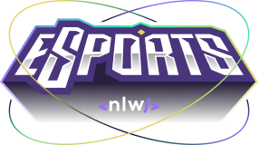

  

 

No **NLW eSports** estamos desenvolvendo uma plataforma Web e Mobile, onde Gamers podem encontrar parceiros para seus jogos favoritos.
O projeto foi desenvolvido com React/TypeScript e React Native com Expo. 
Foi criado um server Fake que simulia os Games, na aplicação WEB, é possível criar anúncios para encontrar parceiros (ou duos).
Já na aplicação mobile, é possível acessar esses anúncios e visualizar as informações pertinentes a cada jogador, 
além de ser possível copiar para a área de transferência o nome de usuário do Discord do jogador para adicioná-lo a sua lista de amigos.

## Stack and tools
* [Node.js](https://nodejs.org/en/)
* [Prisma](https://www.prisma.io/)
* [React](https://reactjs.org/)
* [React Native](https://reactnative.dev/)
* [Expo](https://expo.dev/)
* [Figma](https://www.figma.com/)
* [Radix UI](https://www.radix-ui.com/)

## ⚙ Settings na Web

Segue os comandos para baixar e executar o projeto na sua máquina:

* `git clone` + `URL do Projeto`: clonar este repositório.

### Server
* `npm install`: para baixar as dependências do projeto dentro do diretório `server`.
* `npm run dev`: 
    - Executa o server em modo/ambiente de desenvolvimento.
    - A página será recarregada o server com os jogos pré-definidos.
    
### Projeto
* `npm install`: para baixar as dependências do projeto dentro do diretório `web`.
* `npm run dev`: 
    - Executa o projeto em modo/ambiente de desenvolvimento.
    - Abra [http://localhost:5173/](http://localhost:5173/) para ver o projeto rodando no Navegador.
